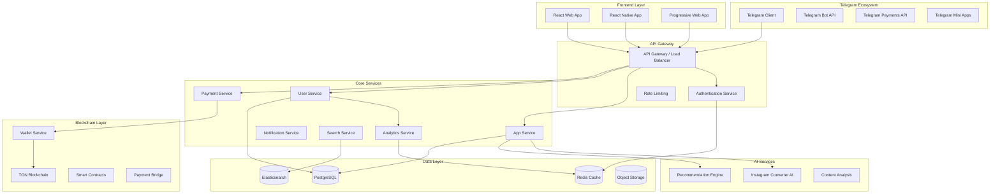

# صفحه ۱: معماری کلی و انتخاب تکنولوژی
# Page 1: Technical Architecture & Technology Stack

## 🏗 معماری کلی سیستم (System Architecture Overview)

### معماری میکروسرویس (Microservices Architecture)



## 🎨 Frontend Architecture

### **Primary Framework: React 18 + TypeScript**

#### **انتخاب فریم‌ورک و دلایل:**
- **React 18**: برای استفاده از Concurrent Features و بهینه‌سازی عملکرد
- **TypeScript**: Type safety و developer experience بهتر
- **Vite**: برای build tool سریع و hot reload
- **React Query (TanStack Query)**: مدیریت server state
- **Zustand**: مدیریت client state

#### **ساختار پروژه Frontend:**

```
frontend/
├── public/
│   ├── icons/
│   ├── images/
│   └── manifest.json
├── src/
│   ├── components/
│   │   ├── ui/                     # Base UI components
│   │   ├── layout/                 # Layout components
│   │   ├── forms/                  # Form components
│   │   └── features/               # Feature-specific components
│   ├── pages/
│   │   ├── Home/
│   │   ├── Explore/
│   │   ├── Detail/
│   │   ├── Wallet/
│   │   ├── Profile/
│   │   └── Developer/
│   ├── hooks/                      # Custom React hooks
│   ├── services/                   # API services
│   ├── stores/                     # Zustand stores
│   ├── types/                      # TypeScript definitions
│   ├── utils/                      # Utility functions
│   ├── styles/                     # Global styles
│   └── locales/                    # i18n translations
├── tailwind.config.js
├── vite.config.ts
└── package.json
```

#### **استایل‌دهی و طراحی:**

```typescript
// tailwind.config.js
module.exports = {
  content: ['./src/**/*.{js,ts,jsx,tsx}'],
  darkMode: 'class',
  theme: {
    extend: {
      colors: {
        persian: {
          blue: '#1C9CEA',
          pink: '#F77EBD',
          saffron: '#FF9933',
          dark: '#121212',
          light: '#1E1E1E'
        }
      },
      fontFamily: {
        persian: ['Vazir', 'IRANSans', 'sans-serif']
      },
      backgroundImage: {
        'glass': 'linear-gradient(135deg, rgba(255,255,255,0.1) 0%, rgba(255,255,255,0.05) 100%)',
      },
      backdropBlur: {
        'glass': '20px',
      }
    }
  },
  plugins: [
    require('@tailwindcss/forms'),
    require('@tailwindcss/typography'),
    require('tailwindcss-rtl'),
  ]
}
```

#### **پالت رنگی و تم:**

```css
/* Persian Theme Variables */
:root {
  /* Primary Colors */
  --persian-blue: #1C9CEA;
  --persian-pink: #F77EBD;
  --persian-saffron: #FF9933;
  
  /* Background Colors */
  --bg-primary: #121212;
  --bg-secondary: #1E1E1E;
  --bg-tertiary: #2A2A2A;
  
  /* Text Colors */
  --text-primary: #FFFFFF;
  --text-secondary: #888888;
  --text-accent: #1C9CEA;
  
  /* Glass Morphism */
  --glass-bg: rgba(255, 255, 255, 0.1);
  --glass-border: rgba(255, 255, 255, 0.2);
  --glass-shadow: 0 8px 32px rgba(0, 0, 0, 0.3);
}

.glass-card {
  background: var(--glass-bg);
  backdrop-filter: blur(20px);
  border: 1px solid var(--glass-border);
  box-shadow: var(--glass-shadow);
  border-radius: 16px;
}
```

## 🔧 Backend Architecture

### **Primary Stack: Node.js + Express + TypeScript**

#### **انتخاب تکنولوژی Backend:**
- **Node.js 18+**: برای عملکرد بالا و ecosystem غنی
- **Express.js**: سادگی و انعطاف‌پذیری
- **TypeScript**: Type safety در backend
- **Prisma**: Modern ORM برای PostgreSQL
- **Redis**: کش و session management
- **Socket.io**: Real-time communication

#### **ساختار میکروسرویس:**

```
backend/
├── gateway/                        # API Gateway
│   ├── src/
│   │   ├── middleware/
│   │   ├── routes/
│   │   └── index.ts
│   └── package.json
├── services/
│   ├── auth-service/               # Authentication
│   ├── user-service/               # User management
│   ├── app-service/                # Mini-app management
│   ├── payment-service/            # Payment processing
│   ├── notification-service/       # Push notifications
│   ├── search-service/             # Search functionality
│   └── analytics-service/          # Analytics & metrics
├── shared/
│   ├── types/                      # Shared TypeScript types
│   ├── utils/                      # Common utilities
│   ├── database/                   # Database schemas
│   └── events/                     # Event definitions
└── docker-compose.yml
```

#### **Database Schema (PostgreSQL):**

```sql
-- Users table
CREATE TABLE users (
    id UUID PRIMARY KEY DEFAULT gen_random_uuid(),
    telegram_id BIGINT UNIQUE NOT NULL,
    username VARCHAR(255),
    first_name VARCHAR(255),
    last_name VARCHAR(255),
    role user_role DEFAULT 'user',
    persian_tokens DECIMAL(18, 8) DEFAULT 0,
    telegram_stars INTEGER DEFAULT 0,
    created_at TIMESTAMP DEFAULT NOW(),
    updated_at TIMESTAMP DEFAULT NOW()
);

-- Mini-apps table
CREATE TABLE mini_apps (
    id UUID PRIMARY KEY DEFAULT gen_random_uuid(),
    developer_id UUID REFERENCES users(id),
    name VARCHAR(255) NOT NULL,
    description TEXT,
    category VARCHAR(100),
    telegram_url TEXT,
    website_url TEXT,
    rating DECIMAL(3, 2) DEFAULT 0,
    install_count INTEGER DEFAULT 0,
    status app_status DEFAULT 'pending',
    created_at TIMESTAMP DEFAULT NOW()
);

-- User roles enum
CREATE TYPE user_role AS ENUM (
    'super_admin',
    'developer', 
    'business_owner',
    'premium_business',
    'user'
);
```

#### **API Documentation (OpenAPI):**

```yaml
# api-spec.yml
openapi: 3.0.0
info:
  title: Persian Mini-App Center API
  version: 1.0.0
  description: API for Persian Mini-App marketplace

paths:
  /api/v1/apps:
    get:
      summary: Get mini-apps list
      parameters:
        - name: category
          in: query
          schema:
            type: string
        - name: page
          in: query
          schema:
            type: integer
      responses:
        200:
          description: Success
          content:
            application/json:
              schema:
                type: object
                properties:
                  apps:
                    type: array
                    items:
                      $ref: '#/components/schemas/MiniApp'
                  pagination:
                    $ref: '#/components/schemas/Pagination'

components:
  schemas:
    MiniApp:
      type: object
      properties:
        id:
          type: string
          format: uuid
        name:
          type: string
        description:
          type: string
        category:
          type: string
        rating:
          type: number
        installCount:
          type: integer
```

## ⛓ Blockchain Integration

### **TON Blockchain Integration**

#### **Smart Contract Architecture:**

```javascript
// persian-token.fc (FunC)
#include "imports/stdlib.fc";

const int PERSIAN_TOKEN_DECIMALS = 9;
const int TOTAL_SUPPLY = 1000000000; // 1 billion tokens

global slice storage::admin_address;
global int storage::total_supply;
global cell storage::balances;

() load_data() impure {
    slice ds = get_data().begin_parse();
    storage::admin_address = ds~load_msg_addr();
    storage::total_supply = ds~load_uint(64);
    storage::balances = ds~load_dict();
}

() save_data() impure {
    set_data(begin_cell()
        .store_slice(storage::admin_address)
        .store_uint(storage::total_supply, 64)
        .store_dict(storage::balances)
        .end_cell());
}

// Reward distribution function
() distribute_reward(slice user_address, int amount) impure {
    load_data();
    
    (slice balance_slice, int found?) = storage::balances.udict_get?(267, user_address);
    int current_balance = found? ? balance_slice~load_uint(64) : 0;
    
    storage::balances~udict_set_builder(267, user_address, 
        begin_cell().store_uint(current_balance + amount, 64));
    
    save_data();
}
```

#### **TON Connect Integration:**

```typescript
// ton-connect.service.ts
import { TonConnect } from '@tonconnect/sdk';

export class TonConnectService {
  private tonConnect: TonConnect;
  
  constructor() {
    this.tonConnect = new TonConnect({
      manifestUrl: 'https://persian-miniapp.center/tonconnect-manifest.json'
    });
  }
  
  async connectWallet(): Promise<string> {
    const walletConnectionSource = {
      universalLink: 'https://wallet.ton.org',
      bridgeUrl: 'https://bridge.tonapi.io/bridge'
    };
    
    const connectedWallet = await this.tonConnect.connect(walletConnectionSource);
    return connectedWallet.account.address;
  }
  
  async sendPersianTokens(toAddress: string, amount: string): Promise<string> {
    const transaction = {
      validUntil: Math.floor(Date.now() / 1000) + 60,
      messages: [
        {
          address: toAddress,
          amount: amount,
          payload: 'PERSIAN token transfer'
        }
      ]
    };
    
    const result = await this.tonConnect.sendTransaction(transaction);
    return result.boc;
  }
}
```

## 🗄 Data Architecture

### **Database Strategy:**

#### **PostgreSQL (Primary Database):**
- کاربران و پروفایل‌ها
- مینی‌اپ‌ها و metadata
- نظرات و امتیازدهی
- تراکنش‌ها و پرداخت‌ها

#### **Redis (Caching & Sessions):**
- Session management
- API rate limiting
- Hot data caching
- Real-time data

#### **Elasticsearch (Search):**
- Full-text search
- Advanced filtering
- Analytics data
- Log aggregation

```typescript
// elasticsearch-config.ts
import { Client } from '@elastic/elasticsearch';

export const elasticClient = new Client({
  node: process.env.ELASTICSEARCH_URL,
  auth: {
    username: process.env.ELASTICSEARCH_USER,
    password: process.env.ELASTICSEARCH_PASS
  }
});

// Mini-app indexing
export interface MiniAppIndex {
  id: string;
  name: string;
  description: string;
  category: string;
  tags: string[];
  rating: number;
  installCount: number;
  createdAt: Date;
}

export async function indexMiniApp(app: MiniAppIndex) {
  await elasticClient.index({
    index: 'mini-apps',
    id: app.id,
    body: app
  });
}
```

## 🔐 Security Architecture

### **Authentication & Authorization:**

```typescript
// auth.middleware.ts
import jwt from 'jsonwebtoken';
import { TelegramUser } from '../types/telegram';

export interface AuthenticatedRequest extends Request {
  user?: TelegramUser;
}

export async function telegramAuth(
  req: AuthenticatedRequest, 
  res: Response, 
  next: NextFunction
) {
  try {
    const initData = req.headers['x-telegram-init-data'] as string;
    
    if (!initData) {
      return res.status(401).json({ error: 'Missing Telegram auth data' });
    }
    
    const user = validateTelegramAuth(initData);
    if (!user) {
      return res.status(401).json({ error: 'Invalid Telegram auth' });
    }
    
    req.user = user;
    next();
  } catch (error) {
    res.status(401).json({ error: 'Authentication failed' });
  }
}

function validateTelegramAuth(initData: string): TelegramUser | null {
  // Validate Telegram WebApp init data
  const data = new URLSearchParams(initData);
  const hash = data.get('hash');
  data.delete('hash');
  
  const secret = crypto
    .createHmac('sha256', 'WebAppData')
    .update(process.env.TELEGRAM_BOT_TOKEN!)
    .digest();
    
  const checkString = Array.from(data.entries())
    .sort(([a], [b]) => a.localeCompare(b))
    .map(([key, value]) => `${key}=${value}`)
    .join('\n');
    
  const computedHash = crypto
    .createHmac('sha256', secret)
    .update(checkString)
    .digest('hex');
    
  if (computedHash !== hash) return null;
  
  return JSON.parse(data.get('user') || '{}');
}
```

## ☁️ Infrastructure & DevOps

### **Cloud Infrastructure:**

```yaml
# docker-compose.yml
version: '3.8'
services:
  api-gateway:
    build: ./gateway
    ports:
      - "3000:3000"
    environment:
      - NODE_ENV=production
      - REDIS_URL=redis://redis:6379
    depends_on:
      - redis
      - postgres
  
  postgres:
    image: postgres:15
    environment:
      POSTGRES_DB: persian_miniapp
      POSTGRES_USER: ${DB_USER}
      POSTGRES_PASSWORD: ${DB_PASSWORD}
    volumes:
      - postgres_data:/var/lib/postgresql/data
  
  redis:
    image: redis:7-alpine
    command: redis-server --appendonly yes
    volumes:
      - redis_data:/data
  
  elasticsearch:
    image: docker.elastic.co/elasticsearch/elasticsearch:8.9.0
    environment:
      - discovery.type=single-node
      - "ES_JAVA_OPTS=-Xms512m -Xmx512m"
    volumes:
      - elastic_data:/usr/share/elasticsearch/data

volumes:
  postgres_data:
  redis_data:
  elastic_data:
```

### **CI/CD Pipeline:**

```yaml
# .github/workflows/deploy.yml
name: Deploy to Production

on:
  push:
    branches: [main]

jobs:
  test:
    runs-on: ubuntu-latest
    steps:
      - uses: actions/checkout@v3
      - uses: actions/setup-node@v3
        with:
          node-version: '18'
      - run: npm ci
      - run: npm run test
      - run: npm run build
  
  deploy:
    needs: test
    runs-on: ubuntu-latest
    steps:
      - name: Deploy to DigitalOcean
        uses: digitalocean/action-doctl@v2
        with:
          token: ${{ secrets.DIGITALOCEAN_ACCESS_TOKEN }}
      - name: Update Kubernetes deployment
        run: |
          doctl kubernetes cluster kubeconfig save persian-cluster
          kubectl set image deployment/api-gateway api-gateway=${{ env.IMAGE_TAG }}
```

## 📊 Performance & Monitoring

### **Performance Targets:**
- **Load Time**: < 3 seconds
- **API Response**: < 500ms
- **Concurrent Users**: 10,000+
- **Uptime**: 99.9%

### **Monitoring Stack:**

```typescript
// monitoring.ts
import prometheus from 'prom-client';

export const httpRequestDuration = new prometheus.Histogram({
  name: 'http_request_duration_seconds',
  help: 'Duration of HTTP requests in seconds',
  labelNames: ['method', 'route', 'status']
});

export const activeUsers = new prometheus.Gauge({
  name: 'active_users_total',
  help: 'Number of currently active users'
});

// Metrics middleware
export function metricsMiddleware(req: Request, res: Response, next: NextFunction) {
  const start = Date.now();
  
  res.on('finish', () => {
    const duration = (Date.now() - start) / 1000;
    httpRequestDuration
      .labels(req.method, req.route?.path || req.path, res.statusCode.toString())
      .observe(duration);
  });
  
  next();
}
```

## 🔄 API Design

### **RESTful API Standards:**

```typescript
// api-routes.ts
export const API_ROUTES = {
  // Mini-Apps
  APPS: {
    LIST: '/api/v1/apps',
    DETAIL: '/api/v1/apps/:id',
    INSTALL: '/api/v1/apps/:id/install',
    RATE: '/api/v1/apps/:id/rate'
  },
  
  // Users
  USERS: {
    PROFILE: '/api/v1/users/profile',
    REWARDS: '/api/v1/users/rewards',
    TRANSACTIONS: '/api/v1/users/transactions'
  },
  
  // Developers
  DEVELOPERS: {
    DASHBOARD: '/api/v1/developers/dashboard',
    APPS: '/api/v1/developers/apps',
    ANALYTICS: '/api/v1/developers/analytics'
  }
} as const;
```

---

## 📈 Scalability Considerations

### **Horizontal Scaling:**
- Load balancing با NGINX
- Database sharding استراتژی
- CDN برای static assets
- Auto-scaling در Kubernetes

### **Caching Strategy:**
- Redis برای hot data
- CDN برای images و static files
- Application-level caching
- Database query optimization

این معماری بر اساس بهترین روش‌های مدرن طراحی شده و قابلیت scale کردن تا میلیون‌ها کاربر را دارد. در صفحه بعدی، طراحی UX/UI و رابط کاربری را بررسی خواهیم کرد.