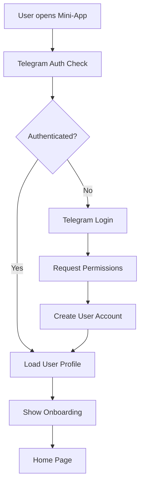
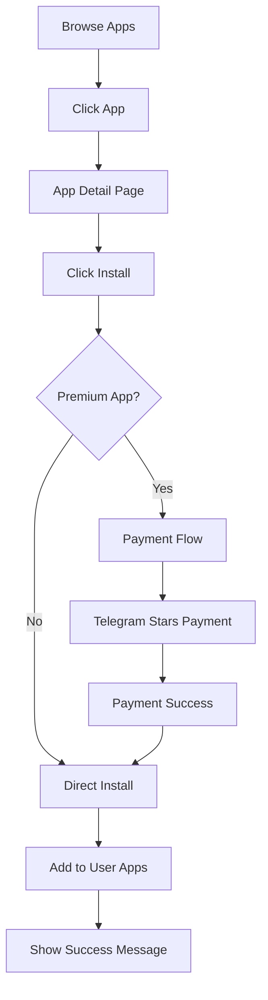

# صفحه ۲: طراحی UX/UI و رابط کاربری
# Page 2: UX/UI Design Specifications

## 🎨 Design Philosophy

### **Dark Mode First with Glassmorphism**
- **Primary Theme**: Dark charcoal backgrounds with glass-like surfaces
- **Typography**: Vazir/IRANSans fonts with perfect RTL support
- **Animations**: Subtle micro-interactions using Framer Motion
- **Accessibility**: WCAG 2.1 AA compliant with screen reader support

### **Color Palette**
```css
:root {
  --persian-blue: #1C9CEA;      /* Primary brand color */
  --persian-pink: #F77EBD;      /* Accent for CTAs */
  --saffron: #FF9933;           /* Warning/highlight */
  --bg-primary: #121212;        /* Main background */
  --bg-secondary: #1E1E1E;      /* Card backgrounds */
  --text-primary: #FFFFFF;      /* Main text */
  --text-secondary: #888888;    /* Secondary text */
  --glass-bg: rgba(255,255,255,0.1);
  --glass-border: rgba(255,255,255,0.2);
}
```

## 📱 Page Layouts & Components

### **1. صفحه خانه (Home Page)**

#### Hero Section
```jsx
// Hero Carousel Component
<div className="hero-carousel glass-card p-6 mb-8">
  <Swiper autoplay pagination navigation>
    <SwiperSlide>
      <div className="hero-slide bg-gradient-persian">
        <h2>مینی‌اپ‌های داغ امروز</h2>
        <p>بهترین اپلیکیشن‌های فارسی را کشف کنید</p>
        <Button variant="persian-pink">مشاهده همه</Button>
      </div>
    </SwiperSlide>
  </Swiper>
</div>
```

#### Category Grid
```jsx
// Category Cards
<div className="categories-grid grid grid-cols-2 md:grid-cols-4 gap-4">
  <CategoryCard 
    icon="🛍️" 
    title="خرید و فروش" 
    count="120+ اپ"
    gradient="from-persian-blue to-persian-pink"
  />
  <CategoryCard 
    icon="💰" 
    title="خدمات مالی" 
    count="45+ اپ"
    gradient="from-saffron to-persian-blue"
  />
</div>
```

### **2. صفحه کشف (Explore Page)**

#### Filter System
```jsx
<div className="filter-system sticky top-0 z-10 bg-bg-primary/80 backdrop-blur-md">
  <div className="filter-tabs flex overflow-x-auto">
    <Tab active>همه</Tab>
    <Tab>مینی‌اپ‌ها</Tab>
    <Tab>ربات‌ها</Tab>
    <Tab>کانال‌ها</Tab>
    <Tab>گروه‌ها</Tab>
  </div>
  
  <div className="filter-options mt-4">
    <Select placeholder="دسته‌بندی">
      <Option value="ecommerce">خرید و فروش</Option>
      <Option value="finance">خدمات مالی</Option>
    </Select>
    <Select placeholder="امتیاز">
      <Option value="5">5 ستاره</Option>
      <Option value="4">4+ ستاره</Option>
    </Select>
  </div>
</div>
```

### **3. صفحه جزئیات (Detail Page)**

#### App Header
```jsx
<div className="app-header glass-card p-6">
  <div className="flex items-start gap-4">
    
    <div className="flex-1">
      <h1 className="text-2xl font-bold text-white">{app.name}</h1>
      <p className="text-text-secondary">{app.developer}</p>
      <div className="flex items-center gap-2 mt-2">
        <StarRating value={app.rating} />
        <span>{app.rating}</span>
        <span className="text-text-secondary">({app.reviewCount} نظر)</span>
      </div>
    </div>
    <Button variant="persian-pink" size="lg">
      نصب
    </Button>
  </div>
</div>
```

#### Screenshots Gallery
```jsx
<div className="screenshots-section mt-6">
  <h3 className="text-lg font-semibold mb-4">تصاویر</h3>
  <div className="screenshots-carousel">
    <Swiper spaceBetween={16} slidesPerView="auto">
      {app.screenshots.map((screenshot, index) => (
        <SwiperSlide key={index} className="w-64">
           openLightbox(index)}
          />
        </SwiperSlide>
      ))}
    </Swiper>
  </div>
</div>
```

### **4. صفحه کیف پول (Wallet Page)**

#### Balance Cards
```jsx
<div className="balance-section grid grid-cols-1 md:grid-cols-3 gap-4">
  <BalanceCard
    title="Telegram Stars"
    amount={user.telegramStars}
    icon="⭐"
    gradient="from-saffron to-yellow-500"
  />
  <BalanceCard
    title="Persian Tokens"
    amount={user.persianTokens}
    icon="💎"
    gradient="from-persian-blue to-persian-pink"
  />
  <BalanceCard
    title="TON"
    amount={user.tonBalance}
    icon="💰"
    gradient="from-blue-500 to-cyan-500"
  />
</div>
```

#### Exchange Interface
```jsx
<div className="exchange-section glass-card p-6 mt-6">
  <h3 className="text-xl font-semibold mb-4">تبدیل ارز</h3>
  
  <div className="exchange-form">
    <div className="from-section">
      <label>از</label>
      <div className="flex items-center gap-2">
        <input 
          type="number" 
          placeholder="0.00"
          className="exchange-input"
        />
        <Select value="TOMAN">
          <Option value="TOMAN">تومان</Option>
          <Option value="STARS">Stars</Option>
          <Option value="PERSIAN">Persian</Option>
        </Select>
      </div>
    </div>
    
    <div className="exchange-arrow">
      <IconArrowUpDown />
    </div>
    
    <div className="to-section">
      <label>به</label>
      <div className="flex items-center gap-2">
        <input 
          type="number" 
          placeholder="0.00"
          readOnly
          className="exchange-input"
        />
        <Select value="STARS">
          <Option value="STARS">Stars</Option>
          <Option value="PERSIAN">Persian</Option>
          <Option value="TON">TON</Option>
        </Select>
      </div>
    </div>
    
    <Button variant="persian-pink" size="lg" className="w-full mt-4">
      تبدیل
    </Button>
  </div>
</div>
```

### **5. پنل توسعه‌دهندگان (Developer Dashboard)**

#### Analytics Cards
```jsx
<div className="analytics-grid grid grid-cols-1 md:grid-cols-4 gap-4">
  <AnalyticsCard
    title="کل بازدیدها"
    value="12,345"
    change="+12%"
    trend="up"
  />
  <AnalyticsCard
    title="نصب‌های جدید"
    value="1,234"
    change="+5%"
    trend="up"
  />
  <AnalyticsCard
    title="درآمد Stars"
    value="567"
    change="-2%"
    trend="down"
  />
  <AnalyticsCard
    title="امتیاز میانگین"
    value="4.8"
    change="+0.1"
    trend="up"
  />
</div>
```

## 🔧 Component Library

### **Base Components**

#### Button Component
```tsx
interface ButtonProps {
  variant?: 'persian-blue' | 'persian-pink' | 'glass' | 'outline';
  size?: 'sm' | 'md' | 'lg';
  children: React.ReactNode;
  onClick?: () => void;
  disabled?: boolean;
}

const Button: React.FC<ButtonProps> = ({ 
  variant = 'persian-blue', 
  size = 'md', 
  children, 
  ...props 
}) => {
  const baseClasses = "rounded-xl font-medium transition-all duration-200";
  const variants = {
    'persian-blue': 'bg-persian-blue hover:bg-persian-blue/90 text-white',
    'persian-pink': 'bg-persian-pink hover:bg-persian-pink/90 text-white',
    'glass': 'glass-card hover:bg-white/20 text-white',
    'outline': 'border border-white/20 hover:bg-white/10 text-white'
  };
  const sizes = {
    'sm': 'px-3 py-1.5 text-sm',
    'md': 'px-4 py-2 text-base',
    'lg': 'px-6 py-3 text-lg'
  };
  
  return (
    <button 
      className={`${baseClasses} ${variants[variant]} ${sizes[size]}`}
      {...props}
    >
      {children}
    </button>
  );
};
```

#### Card Component
```tsx
interface CardProps {
  children: React.ReactNode;
  className?: string;
  variant?: 'glass' | 'solid';
  padding?: 'sm' | 'md' | 'lg';
}

const Card: React.FC<CardProps> = ({ 
  children, 
  className = '', 
  variant = 'glass',
  padding = 'md'
}) => {
  const variants = {
    'glass': 'glass-card',
    'solid': 'bg-bg-secondary border border-white/10'
  };
  const paddings = {
    'sm': 'p-4',
    'md': 'p-6',
    'lg': 'p-8'
  };
  
  return (
    <div className={`${variants[variant]} ${paddings[padding]} ${className}`}>
      {children}
    </div>
  );
};
```

## 📊 User Flows & Wireframes

### **User Registration Flow**


### **App Installation Flow**


## 🎭 Responsive Design

### **Mobile First Approach**
```css
/* Mobile (default) */
.container {
  padding: 1rem;
}

.grid-apps {
  grid-template-columns: 1fr;
  gap: 1rem;
}

/* Tablet */
@media (min-width: 768px) {
  .container {
    padding: 2rem;
  }
  
  .grid-apps {
    grid-template-columns: repeat(2, 1fr);
    gap: 1.5rem;
  }
}

/* Desktop */
@media (min-width: 1024px) {
  .container {
    max-width: 1200px;
    margin: 0 auto;
    padding: 3rem;
  }
  
  .grid-apps {
    grid-template-columns: repeat(3, 1fr);
    gap: 2rem;
  }
}
```

## ⚡ Performance Optimizations

### **Image Optimization**
```tsx
// Optimized Image Component
const OptimizedImage: React.FC<{
  src: string;
  alt: string;
  width: number;
  height: number;
}> = ({ src, alt, width, height }) => {
  return (
    
  );
};
```

### **Lazy Loading Components**
```tsx
// Lazy load heavy components
const DeveloperDashboard = lazy(() => import('./pages/DeveloperDashboard'));
const WalletPage = lazy(() => import('./pages/WalletPage'));

// Usage with Suspense
<Suspense fallback={<LoadingSpinner />}>
  <DeveloperDashboard />
</Suspense>
```

این طراحی UX/UI با تمرکز بر تجربه کاربری ایرانی و استفاده از بهترین روش‌های مدرن طراحی شده است.