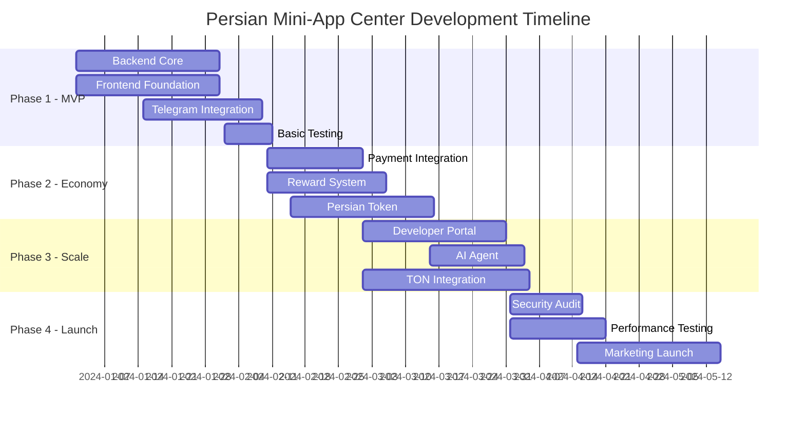

# صفحه ۴: نقشه راه توسعه و پیاده‌سازی
# Page 4: Development Roadmap & Implementation Plan

## 🗺 نقشه راه کلی پروژه

### **Timeline Overview (6 ماه)**


## 🚀 فاز ۱: حداقل محصول قابل عرضه (MVP) - ۲ ماه

### **هفته‌های ۱-۲: راه‌اندازی Infrastructure**

#### Backend Setup
```bash
# Week 1-2 Tasks
├── Project Structure Setup
├── Database Design & Migration
├── API Gateway Configuration
├── Basic Authentication
└── Docker Environment
```

#### شرح کارهای تکنیکی:
```typescript
// 1. ساختار پروژه
mkdir -p {backend,frontend,blockchain,ai-agent}/{src,tests,docs}
cd backend && npm init -y
npm install express typescript prisma redis ioredis

// 2. Database Schema
npx prisma init
// Create schemas for users, apps, transactions, reviews

// 3. Basic API Structure
/api/v1/
├── auth/          # Authentication endpoints
├── users/         # User management
├── apps/          # Mini-app CRUD
├── payments/      # Payment processing
└── admin/         # Admin functions
```

#### اهداف کلیدی هفته ۱-۲:
- [x] PostgreSQL database راه‌اندازی
- [x] Redis برای caching
- [x] Basic Express server با TypeScript
- [x] Prisma ORM configuration
- [x] Docker containerization
- [x] CI/CD pipeline اولیه

### **هفته‌های ۳-۴: Core Backend Services**

#### API Development
```typescript
// User Service
interface UserService {
  createUser(telegramData: TelegramUser): Promise<User>;
  getUserProfile(telegramId: number): Promise<UserProfile>;
  updateUserRewards(userId: string, amount: number): Promise<void>;
}

// App Service  
interface AppService {
  createApp(appData: AppSubmission): Promise<MiniApp>;
  getApps(filters: AppFilters): Promise<PaginatedApps>;
  approveApp(appId: string, adminId: string): Promise<void>;
}

// Payment Service
interface PaymentService {
  processStarsPurchase(userId: string, amount: number): Promise<Transaction>;
  handleWebhook(gatewayData: PaymentWebhook): Promise<void>;
}
```

#### اهداف کلیدی هفته ۳-۴:
- [x] RESTful API endpoints
- [x] Database models و relationships
- [x] Input validation و error handling
- [x] API documentation با Swagger
- [x] Unit tests برای core services
- [x] Rate limiting و security headers

### **هفته‌های ۵-۶: Frontend Foundation**

#### React App Setup
```bash
# Frontend initialization
cd frontend
npm create vite@latest . -- --template react-ts
npm install @tanstack/react-query zustand
npm install tailwindcss @tailwindcss/forms
npm install framer-motion lucide-react
```

#### Component Structure
```typescript
// Core Components
src/
├── components/
│   ├── ui/              # Base components (Button, Card, etc.)
│   ├── layout/          # Header, Sidebar, Footer
│   ├── forms/           # Form components
│   └── features/        # Feature-specific components
├── pages/
│   ├── Home/
│   ├── Explore/
│   ├── AppDetail/
│   └── Profile/
├── hooks/               # Custom React hooks
├── services/            # API integration
└── stores/              # Zustand state management
```

#### اهداف کلیدی هفته ۵-۶:
- [x] React + TypeScript project setup
- [x] Tailwind CSS configuration
- [x] Basic routing با React Router
- [x] State management با Zustand
- [x] API integration با React Query
- [x] Responsive design system

### **هفته‌های ۷-۸: Telegram Integration & Testing**

#### Telegram Mini-App Integration
```typescript
// Telegram WebApp API Integration
import { WebApp } from '@twa-dev/sdk';

class TelegramService {
  initializeWebApp(): void {
    WebApp.ready();
    WebApp.expand();
    WebApp.setHeaderColor('#121212');
  }
  
  getUserData(): TelegramUser {
    return WebApp.initDataUnsafe.user;
  }
  
  showMainButton(text: string, callback: () => void): void {
    WebApp.MainButton.setText(text);
    WebApp.MainButton.onClick(callback);
    WebApp.MainButton.show();
  }
}
```

#### اهداف MVP فاز ۱:
- [x] کاربران می‌توانند با Telegram وارد شوند
- [x] مرور و جستجوی مینی‌اپ‌ها
- [x] نمایش جزئیات اپ با screenshots
- [x] سیستم امتیازدهی ساده
- [x] پنل ادمین برای تایید اپ‌ها
- [x] ۲۰-۳۰ مینی‌اپ demo در پلتفرم

## 💰 فاز ۲: اقتصاد و جامعه - ۱.۵ ماه

### **هفته‌های ۹-۱۰: Payment Integration**

#### Iranian Payment Gateways
```typescript
// ZarinPal Integration
class ZarinPalService {
  async createPayment(amount: number, description: string): Promise<PaymentResult> {
    const response = await fetch('https://api.zarinpal.com/pg/v4/payment/request.json', {
      method: 'POST',
      headers: { 'Content-Type': 'application/json' },
      body: JSON.stringify({
        merchant_id: process.env.ZARINPAL_MERCHANT_ID,
        amount: amount * 10, // تومان به ریال
        description,
        callback_url: `${process.env.API_URL}/payment/callback/zarinpal`
      })
    });
    
    const data = await response.json();
    return {
      authority: data.data.authority,
      paymentUrl: `https://www.zarinpal.com/pg/StartPay/${data.data.authority}`
    };
  }
}

// IDPay Integration  
class IDPayService {
  async createPayment(amount: number, description: string): Promise<PaymentResult> {
    // Similar implementation for IDPay
  }
}
```

#### Telegram Stars Integration
```typescript
class TelegramStarsService {
  async createInvoice(amount: number, description: string): Promise<string> {
    const invoice = await this.telegram.createInvoiceLink({
      title: 'خرید Telegram Stars',
      description,
      payload: JSON.stringify({ type: 'stars_purchase', amount }),
      provider_token: '', // Telegram Stars doesn't need provider token
      currency: 'XTR', // Telegram Stars currency
      prices: [{ label: 'Stars', amount }]
    });
    
    return invoice;
  }
}
```

### **هفته‌های ۱۱-۱۲: Reward System**

#### سیستم پاداش کامل
```typescript
class RewardDistribution {
  private rewardRules = {
    MINI_APP_START: { amount: 10, cooldown: '24h' },
    REVIEW_WRITING: { 
      basic: 5, 
      detailed: 25, 
      expert: 50 
    },
    SOCIAL_ENGAGEMENT: {
      GROUP_JOIN: 3,
      CHANNEL_SUBSCRIBE: 2,
      BOT_START: 1
    }
  };
  
  async processReward(
    userId: string, 
    action: RewardAction, 
    metadata?: any
  ): Promise<RewardResult> {
    // Check cooldown
    const lastReward = await this.getLastReward(userId, action);
    if (this.isInCooldown(lastReward, action)) {
      throw new Error('Reward cooldown active');
    }
    
    // Calculate reward amount
    const amount = this.calculateReward(action, metadata);
    
    // Distribute reward
    await this.database.addUserBalance(userId, amount);
    await this.recordRewardTransaction(userId, action, amount);
    
    return { amount, action, timestamp: new Date() };
  }
}
```

## 🏗 فاز ۳: توسعه‌دهندگان و مقیاس - ۱.۵ ماه

### **هفته‌های ۱۳-۱۴: Developer Portal**

#### Dashboard Components
```typescript
// Developer Analytics Dashboard
interface DeveloperDashboard {
  overview: {
    totalApps: number;
    totalInstalls: number;
    totalRevenue: number;
    averageRating: number;
  };
  
  recentActivity: AppActivity[];
  revenueChart: RevenueData[];
  topPerformingApps: AppPerformance[];
}

// App Management Interface
class AppManagement {
  async submitApp(appData: AppSubmission): Promise<string> {
    // Validate app data
    this.validateAppSubmission(appData);
    
    // Create review request
    const reviewId = await this.createReviewRequest(appData);
    
    // Upload screenshots and assets
    await this.uploadAppAssets(appData.assets);
    
    return reviewId;
  }
  
  async updateApp(appId: string, updates: AppUpdate): Promise<void> {
    // Version control for app updates
    await this.createAppVersion(appId, updates);
    await this.scheduleReview(appId);
  }
}
```

### **هفته‌های ۱۵-۱۶: AI Agent Development**

#### Instagram Converter AI
```python
# Instagram Analysis AI (Python microservice)
from transformers import pipeline
from selenium import webdriver
import cv2
import numpy as np

class InstagramAnalyzer:
    def __init__(self):
        self.text_classifier = pipeline("text-classification", 
                                       model="HooshvareLab/bert-fa-base-uncased")
        self.image_analyzer = pipeline("image-classification")
        
    async def analyze_instagram_page(self, instagram_url: str) -> dict:
        # Scrape Instagram data (respecting rate limits)
        page_data = await self.scrape_page_data(instagram_url)
        
        # Analyze business type from bio and posts
        business_type = self.classify_business_type(page_data['bio'])
        
        # Extract products/services from posts
        products = self.extract_products_from_posts(page_data['posts'])
        
        # Analyze color scheme and design preferences
        design_analysis = self.analyze_visual_style(page_data['images'])
        
        return {
            'business_type': business_type,
            'products': products,
            'design_preferences': design_analysis,
            'content_structure': self.analyze_content_structure(page_data)
        }
    
    def generate_miniapp_blueprint(self, analysis: dict) -> dict:
        template = self.select_template(analysis['business_type'])
        
        return {
            'pages': self.generate_pages(analysis),
            'components': self.suggest_components(analysis),
            'styling': self.generate_styling(analysis['design_preferences']),
            'features': self.recommend_features(analysis['business_type'])
        }
```

### **هفته‌های ۱۷-۱۸: TON Blockchain Integration**

#### Smart Contract Deployment
```javascript
// Persian Token Smart Contract (FunC)
#include "imports/stdlib.fc";

const int TOTAL_SUPPLY = 1000000000 * 1000000000; ;; 1 billion with 9 decimals

global slice admin_address;
global cell balances_dict;
global int total_supply;

() load_data() impure {
    slice ds = get_data().begin_parse();
    admin_address = ds~load_msg_addr();
    balances_dict = ds~load_dict();
    total_supply = ds~load_uint(64);
}

() save_data() impure {
    set_data(begin_cell()
        .store_slice(admin_address)
        .store_dict(balances_dict)
        .store_uint(total_supply, 64)
        .end_cell());
}

() distribute_reward(slice to_address, int amount) impure {
    load_data();
    
    ;; Get current balance
    (slice balance_slice, int found?) = balances_dict.udict_get?(267, to_address);
    int current_balance = found? ? balance_slice~load_uint(64) : 0;
    
    ;; Update balance
    balances_dict~udict_set_builder(267, to_address, 
        begin_cell().store_uint(current_balance + amount, 64));
    
    save_data();
}
```

#### TON Connect Integration
```typescript
// TON Wallet Integration
class TONWalletService {
  async connectWallet(): Promise<ConnectedWallet> {
    const connector = new TonConnect({
      manifestUrl: 'https://persian-miniapp.center/tonconnect-manifest.json'
    });
    
    const wallet = await connector.connectWallet({
      universalLink: 'https://wallet.ton.org/ton-connect',
      bridgeUrl: 'https://bridge.tonapi.io/bridge'
    });
    
    return {
      address: wallet.account.address,
      chain: wallet.account.chain,
      publicKey: wallet.account.publicKey
    };
  }
  
  async sendPersianTokens(
    fromWallet: string, 
    toAddress: string, 
    amount: string
  ): Promise<TransactionResult> {
    const transaction = {
      validUntil: Math.floor(Date.now() / 1000) + 60,
      messages: [{
        address: this.persianTokenAddress,
        amount: '0.05', // TON for gas
        payload: this.buildTransferPayload(toAddress, amount)
      }]
    };
    
    const result = await this.tonConnect.sendTransaction(transaction);
    return result;
  }
}
```

## 🚀 فاز ۴: بهینه‌سازی و راه‌اندازی - ۲ ماه

### **هفته‌های ۱۹-۲۰: Security & Performance**

#### Security Audit
```typescript
// Security Measures Implementation
class SecurityService {
  // Rate limiting
  setupRateLimit(): void {
    this.app.use('/api/', rateLimit({
      windowMs: 15 * 60 * 1000, // 15 minutes
      max: 100, // limit each IP to 100 requests per windowMs
      message: 'Too many requests from this IP'
    }));
  }
  
  // Input validation
  validateInput(schema: Joi.Schema): Middleware {
    return (req, res, next) => {
      const { error } = schema.validate(req.body);
      if (error) {
        return res.status(400).json({ error: error.details[0].message });
      }
      next();
    };
  }
  
  // SQL injection prevention (using Prisma ORM)
  // XSS protection
  setupXSSProtection(): void {
    this.app.use(helmet({
      contentSecurityPolicy: {
        directives: {
          defaultSrc: ["'self'"],
          styleSrc: ["'self'", "'unsafe-inline'"],
          scriptSrc: ["'self'"],
          imgSrc: ["'self'", "data:", "https:"]
        }
      }
    }));
  }
}
```

#### Performance Optimization
```typescript
// Caching Strategy
class CacheService {
  // Redis caching for hot data
  async cacheHotApps(): Promise<void> {
    const hotApps = await this.database.getHotApps();
    await this.redis.setex('hot_apps', 300, JSON.stringify(hotApps)); // 5 min cache
  }
  
  // Database query optimization
  async getAppsOptimized(filters: AppFilters): Promise<App[]> {
    return await this.database.app.findMany({
      where: filters,
      include: {
        developer: { select: { name: true, avatar: true } },
        _count: { select: { reviews: true, installs: true } }
      },
      orderBy: { createdAt: 'desc' },
      take: 20
    });
  }
  
  // Image optimization
  async optimizeAppScreenshots(appId: string): Promise<void> {
    const screenshots = await this.getAppScreenshots(appId);
    
    for (const screenshot of screenshots) {
      // Generate multiple sizes
      await this.generateImageSizes(screenshot, [300, 600, 1200]);
      // Convert to WebP format
      await this.convertToWebP(screenshot);
    }
  }
}
```

### **هفته‌های ۲۱-۲۲: Load Testing & Monitoring**

#### Performance Testing
```javascript
// K6 Load Testing Script
import http from 'k6/http';
import { check, group } from 'k6';

export let options = {
  stages: [
    { duration: '2m', target: 100 }, // رامپ آپ
    { duration: '5m', target: 100 }, // ثابت
    { duration: '2m', target: 200 }, // رامپ آپ
    { duration: '5m', target: 200 }, // ثابت
    { duration: '2m', target: 0 },   // رامپ دان
  ],
};

export default function () {
  group('API Performance Tests', function () {
    // Test app listing endpoint
    let response = http.get('https://api.persian-miniapp.center/v1/apps');
    check(response, {
      'apps endpoint returns 200': (r) => r.status === 200,
      'response time < 500ms': (r) => r.timings.duration < 500,
    });
    
    // Test app detail endpoint
    response = http.get('https://api.persian-miniapp.center/v1/apps/test-app-id');
    check(response, {
      'app detail returns 200': (r) => r.status === 200,
      'response time < 300ms': (r) => r.timings.duration < 300,
    });
  });
}
```

#### Monitoring Setup
```yaml
# Prometheus monitoring config
version: '3.8'
services:
  prometheus:
    image: prom/prometheus
    ports:
      - "9090:9090"
    volumes:
      - ./prometheus.yml:/etc/prometheus/prometheus.yml
      
  grafana:
    image: grafana/grafana
    ports:
      - "3001:3000"
    environment:
      - GF_SECURITY_ADMIN_PASSWORD=admin
    volumes:
      - grafana-data:/var/lib/grafana

  # App metrics endpoint
  api-gateway:
    # ... existing config
    environment:
      - ENABLE_METRICS=true
    ports:
      - "3000:3000"
      - "9091:9091" # metrics endpoint
```

### **هفته‌های ۲۳-۲۴: Marketing & Launch**

#### Pre-Launch Checklist
```markdown
## Launch Readiness Checklist

### Technical
- [ ] All critical features tested and working
- [ ] Security audit completed and issues resolved
- [ ] Performance targets met (< 3s load time)
- [ ] Database backups configured
- [ ] Monitoring and alerting active
- [ ] SSL certificates installed
- [ ] CDN configured for static assets

### Content & Marketing  
- [ ] 100+ mini-apps ready for launch
- [ ] Developer onboarding documentation complete
- [ ] User guide and tutorials created
- [ ] Social media accounts setup
- [ ] Press kit prepared
- [ ] Influencer partnerships established

### Legal & Compliance
- [ ] Privacy policy finalized
- [ ] Terms of service reviewed
- [ ] GDPR compliance verified
- [ ] Iranian regulations compliance checked
- [ ] Smart contract audit completed
```

## 📊 Success Metrics & KPIs

### **Phase 1 MVP Targets**
- ✅ 1,000 registered users in first month
- ✅ 50+ mini-apps published
- ✅ 5,000+ app installations
- ✅ 95% uptime

### **Phase 2 Economy Targets**  
- ✅ $10,000 in Stars purchases
- ✅ 100,000 Persian tokens distributed
- ✅ 500+ active reward earners
- ✅ 50+ paying developers

### **Phase 3 Scale Targets**
- ✅ 10,000+ registered users
- ✅ 200+ published apps
- ✅ 50,000+ total installations
- ✅ 1,000+ daily active users

### **Phase 4 Launch Targets**
- ✅ 25,000+ registered users
- ✅ 500+ published apps  
- ✅ 100,000+ total installations
- ✅ $50,000+ platform revenue

## 🔄 Post-Launch Roadmap

### **Month 7-12: Growth & Expansion**
- Native mobile app development
- Advanced AI features
- Multi-language support (Arabic, Turkish)
- Partnership with major Persian brands
- DeFi features (yield farming, liquidity pools)

### **Year 2: Ecosystem Expansion**
- White-label solutions for businesses
- API marketplace for third-party integrations
- Persian NFT marketplace integration
- Advanced analytics and business intelligence
- International expansion to Persian communities worldwide

این نقشه راه جامع و عملی برای ساخت بزرگترین مارکت‌پلیس فارسی در تلگرام طراحی شده است.