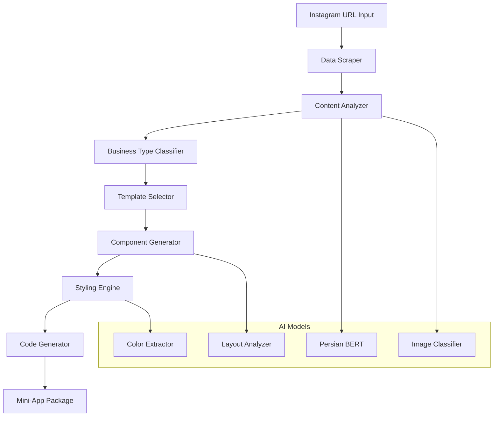

# مشخصات ایجنت هوش مصنوعی برای تبدیل اینستاگرام
# AI Agent Specifications for Instagram Conversion

## 🤖 معماری ایجنت هوش مصنوعی

### **هدف کلی**
تبدیل خودکار صفحات کسب‌وکار اینستاگرام به مینی‌اپ‌های کاملاً کارآمد تلگرام با حفظ هویت بصری و محتوایی برند.

### **Architecture Overview**


## 🔍 Data Extraction Layer

### **Instagram Scraper Service**
```python
import instaloader
import requests
from selenium import webdriver
from bs4 import BeautifulSoup
import time
import random

class InstagramScraper:
    def __init__(self):
        self.loader = instaloader.Instaloader()
        self.rate_limiter = RateLimiter()
        
    async def scrape_business_profile(self, username: str) -> BusinessProfile:
        """
        استخراج اطلاعات کامل از پروفایل کسب‌وکار
        """
        try:
            profile = instaloader.Profile.from_username(self.loader.context, username)
            
            # Basic profile info
            profile_data = {
                'username': profile.username,
                'full_name': profile.full_name,
                'biography': profile.biography,
                'followers_count': profile.followers,
                'following_count': profile.followees,
                'posts_count': profile.mediacount,
                'profile_pic_url': profile.profile_pic_url,
                'is_business': profile.is_business_account,
                'category': profile.business_category_name,
                'contact_info': {
                    'email': profile.business_email,
                    'phone': profile.business_phone_number,
                    'address': profile.business_address
                }
            }
            
            # Extract recent posts
            posts = await self.extract_recent_posts(profile)
            
            # Extract highlights
            highlights = await self.extract_highlights(profile)
            
            # Extract products (if available)
            products = await self.extract_products(profile)
            
            return BusinessProfile(
                profile_data=profile_data,
                posts=posts,
                highlights=highlights,
                products=products
            )
            
        except Exception as e:
            logger.error(f"Error scraping profile {username}: {e}")
            raise InstagramScrapingError(str(e))
    
    async def extract_recent_posts(self, profile, limit: int = 20) -> List[Post]:
        """
        استخراج پست‌های اخیر با تحلیل محتوا
        """
        posts = []
        
        for post in profile.get_posts():
            if len(posts) >= limit:
                break
                
            await self.rate_limiter.wait()
            
            post_data = {
                'shortcode': post.shortcode,
                'caption': post.caption,
                'likes': post.likes,
                'comments_count': post.comments,
                'date': post.date,
                'is_video': post.is_video,
                'media_urls': [post.url] if not post.is_video else [post.video_url],
                'hashtags': self.extract_hashtags(post.caption),
                'mentions': self.extract_mentions(post.caption)
            }
            
            # Extract multiple images for carousel posts
            if hasattr(post, 'get_sidecar_nodes'):
                post_data['media_urls'] = [
                    node.display_url for node in post.get_sidecar_nodes()
                ]
            
            posts.append(post_data)
            
        return posts
```

### **Content Analysis Engine**
```python
from transformers import pipeline, AutoTokenizer, AutoModel
import cv2
import numpy as np
from sklearn.cluster import KMeans

class ContentAnalyzer:
    def __init__(self):
        # Persian language model for text analysis
        self.persian_classifier = pipeline(
            "text-classification",
            model="HooshvareLab/bert-fa-base-uncased-clf-persiannews"
        )
        
        # Image analysis models
        self.image_classifier = pipeline(
            "image-classification",
            model="google/vit-base-patch16-224"
        )
        
        # Color analysis
        self.color_extractor = ColorExtractor()
        
    async def analyze_business_content(self, profile: BusinessProfile) -> ContentAnalysis:
        """
        تحلیل جامع محتوای کسب‌وکار
        """
        # Analyze bio and posts text
        text_analysis = await self.analyze_textual_content(profile)
        
        # Analyze visual content
        visual_analysis = await self.analyze_visual_content(profile)
        
        # Determine business type
        business_type = await self.classify_business_type(text_analysis, visual_analysis)
        
        # Extract product/service information
        products_services = await self.extract_products_services(profile)
        
        return ContentAnalysis(
            business_type=business_type,
            primary_colors=visual_analysis['dominant_colors'],
            content_themes=text_analysis['themes'],
            posting_style=text_analysis['style'],
            product_catalog=products_services,
            engagement_patterns=await self.analyze_engagement(profile)
        )
    
    async def classify_business_type(self, text_analysis: dict, visual_analysis: dict) -> str:
        """
        تشخیص نوع کسب‌وکار بر اساس محتوا
        """
        # Business type keywords in Persian
        business_keywords = {
            'restaurant': ['رستوران', 'غذا', 'منو', 'آشپزی', 'کافه', 'فست‌فود'],
            'fashion': ['لباس', 'مد', 'پوشاک', 'کفش', 'کیف', 'آرایش'],
            'electronics': ['موبایل', 'لپ‌تاپ', 'کامپیوتر', 'الکترونیک'],
            'beauty': ['زیبایی', 'آرایش', 'پوست', 'مو', 'سالن'],
            'jewelry': ['طلا', 'نقره', 'جواهر', 'زیورآلات'],
            'books': ['کتاب', 'مطالعه', 'نویسنده', 'انتشارات'],
            'fitness': ['ورزش', 'بدنسازی', 'یوگا', 'تناسب‌اندام'],
            'education': ['آموزش', 'کلاس', 'دوره', 'مدرس', 'زبان']
        }
        
        text_content = f"{text_analysis['bio']} {' '.join(text_analysis['post_captions'])}"
        
        scores = {}
        for business_type, keywords in business_keywords.items():
            score = sum(1 for keyword in keywords if keyword in text_content)
            scores[business_type] = score
        
        # Visual analysis for business type
        visual_indicators = visual_analysis.get('detected_objects', [])
        
        # Combine text and visual scores
        return max(scores.items(), key=lambda x: x[1])[0]
```

## 🎨 Template Generation System

### **Dynamic Template Selector**
```python
class TemplateSelector:
    def __init__(self):
        self.templates = self.load_business_templates()
        
    def select_optimal_template(self, analysis: ContentAnalysis) -> Template:
        """
        انتخاب بهترین قالب بر اساس تحلیل کسب‌وکار
        """
        business_type = analysis.business_type
        content_complexity = analysis.content_complexity
        
        if business_type == 'restaurant':
            return self.get_restaurant_template(analysis)
        elif business_type == 'fashion':
            return self.get_fashion_template(analysis)
        elif business_type == 'electronics':
            return self.get_electronics_template(analysis)
        else:
            return self.get_generic_business_template(analysis)
    
    def get_restaurant_template(self, analysis: ContentAnalysis) -> RestaurantTemplate:
        """
        قالب اختصاصی رستوران
        """
        return RestaurantTemplate(
            pages=[
                'home',           # صفحه اصلی با منوی ویژه
                'menu',           # منوی کامل غذا
                'gallery',        # گالری تصاویر غذا
                'reservation',    # رزرو میز
                'contact',        # اطلاعات تماس
                'reviews'         # نظرات مشتریان
            ],
            components={
                'menu_categories': self.extract_menu_categories(analysis),
                'featured_dishes': self.extract_featured_items(analysis),
                'price_ranges': self.extract_pricing_info(analysis),
                'delivery_info': self.extract_delivery_options(analysis)
            },
            features=[
                'online_ordering',
                'table_reservation',
                'loyalty_program',
                'special_offers',
                'location_map'
            ]
        )
    
    def get_fashion_template(self, analysis: ContentAnalysis) -> FashionTemplate:
        """
        قالب اختصاصی پوشاک و مد
        """
        return FashionTemplate(
            pages=[
                'home',
                'catalog',
                'lookbook',
                'size_guide',
                'wishlist',
                'cart',
                'checkout'
            ],
            components={
                'product_categories': self.extract_fashion_categories(analysis),
                'size_charts': self.generate_size_guide(),
                'style_guide': self.extract_styling_tips(analysis),
                'seasonal_collections': self.extract_collections(analysis)
            },
            features=[
                'virtual_try_on',
                'size_recommendation',
                'style_matching',
                'outfit_builder',
                'fashion_calendar'
            ]
        )
```

### **Component Generator**
```typescript
// Frontend component generation
class ComponentGenerator {
  async generateMiniAppComponents(
    template: Template, 
    analysis: ContentAnalysis
  ): Promise<ComponentPackage> {
    
    const components = {
      // Header component with business branding
      header: await this.generateHeader(analysis.branding),
      
      // Navigation adapted to business type
      navigation: await this.generateNavigation(template.pages),
      
      // Product/service listings
      productGrid: await this.generateProductGrid(analysis.products),
      
      // Contact and social components
      contactInfo: await this.generateContactInfo(analysis.contact),
      
      // Custom features based on business type
      specialFeatures: await this.generateSpecialFeatures(template.features)
    };
    
    return new ComponentPackage(components);
  }
  
  private async generateHeader(branding: BrandingInfo): Promise<Component> {
    return {
      type: 'Header',
      props: {
        logo: branding.logo_url,
        businessName: branding.name,
        primaryColor: branding.primary_color,
        subtitle: branding.tagline
      },
      style: {
        backgroundColor: branding.primary_color,
        color: this.getContrastColor(branding.primary_color),
        height: '80px',
        padding: '0 20px'
      },
      template: `
        <header className="business-header">
          
          <div className="business-info">
            <h1>{businessName}</h1>
            <p>{subtitle}</p>
          </div>
        </header>
      `
    };
  }
  
  private async generateProductGrid(products: Product[]): Promise<Component> {
    return {
      type: 'ProductGrid',
      props: {
        products,
        layout: 'grid',
        itemsPerRow: 2,
        showPrices: true,
        showRatings: true
      },
      template: `
        <div className="product-grid">
          {products.map(product => (
            <div key={product.id} className="product-card">
              
              <h3>{product.name}</h3>
              <p className="price">{product.price}</p>
              <button className="add-to-cart">افزودن به سبد</button>
            </div>
          ))}
        </div>
      `
    };
  }
}
```

## 🎯 Event & Campaign Features

### **ایونت و کمپین ساز**
```python
class EventCampaignGenerator:
    def __init__(self):
        self.campaign_templates = {
            'flash_sale': FlashSaleTemplate(),
            'loyalty_program': LoyaltyProgramTemplate(),
            'referral_campaign': ReferralCampaignTemplate(),
            'seasonal_promotion': SeasonalPromotionTemplate()
        }
    
    async def generate_campaign_features(self, business_type: str) -> List[CampaignFeature]:
        """
        تولید ویژگی‌های کمپین بر اساس نوع کسب‌وکار
        """
        features = []
        
        if business_type == 'restaurant':
            features.extend([
                {
                    'type': 'happy_hour',
                    'name': 'ساعت طلایی',
                    'description': 'تخفیف ویژه در ساعات مشخص',
                    'mechanics': {
                        'discount_percentage': 20,
                        'time_range': '14:00-17:00',
                        'applicable_items': 'beverages'
                    }
                },
                {
                    'type': 'loyalty_stamps',
                    'name': 'مهر وفاداری',
                    'description': 'جمع‌آوری مهر برای غذای رایگان',
                    'mechanics': {
                        'stamps_required': 10,
                        'reward': 'free_main_course',
                        'stamp_value': 'per_visit'
                    }
                }
            ])
        
        elif business_type == 'fashion':
            features.extend([
                {
                    'type': 'style_challenge',
                    'name': 'چالش استایل',
                    'description': 'ایجاد ست لباس و برنده شدن جوایز',
                    'mechanics': {
                        'duration': '7_days',
                        'submission_type': 'photo',
                        'voting_system': 'community',
                        'prizes': ['discount_voucher', 'free_item']
                    }
                }
            ])
        
        return features
    
    async def create_reward_system(self, business_type: str) -> RewardSystem:
        """
        ایجاد سیستم پاداش مختص کسب‌وکار
        """
        base_rewards = {
            'app_install': 100,  # Persian tokens
            'first_purchase': 200,
            'review_writing': 50,
            'social_sharing': 25,
            'friend_referral': 300
        }
        
        # Business-specific rewards
        if business_type == 'restaurant':
            base_rewards.update({
                'table_reservation': 30,
                'order_rating': 20,
                'photo_upload': 40
            })
        
        elif business_type == 'fashion':
            base_rewards.update({
                'outfit_photo': 50,
                'size_review': 30,
                'style_tip': 40
            })
        
        return RewardSystem(
            base_rewards=base_rewards,
            multipliers=self.calculate_multipliers(business_type),
            bonus_events=await self.generate_bonus_events(business_type)
        )
```

## 🔄 Challenge & Engagement System

### **سیستم چالش‌ها**
```typescript
interface ChallengeSystem {
  // Daily challenges
  dailyChallenges: {
    'try_new_item': {
      description: 'آیتم جدیدی را امتحان کنید';
      reward: 50;
      frequency: 'daily';
    };
    'write_review': {
      description: 'نظر خود را بنویسید';
      reward: 30;
      frequency: 'daily';
    };
    'share_experience': {
      description: 'تجربه خود را به اشتراک بگذارید';
      reward: 40;
      frequency: 'daily';
    };
  };
  
  // Weekly challenges
  weeklyChallenges: {
    'loyal_customer': {
      description: '۵ بار خرید در یک هفته';
      reward: 500;
      progress_tracking: true;
    };
    'social_ambassador': {
      description: '۳ دوست را دعوت کنید';
      reward: 1000;
      referral_tracking: true;
    };
  };
  
  // Seasonal events
  seasonalEvents: {
    'ramadan_special': {
      duration: '30_days';
      special_rewards: 'double_points';
      themed_challenges: ['iftar_photos', 'recipe_sharing'];
    };
    'nowruz_celebration': {
      duration: '13_days';
      special_features: ['haft_sin_contest', 'traditional_items'];
    };
  };
}

class ChallengeManager {
  async generatePersonalizedChallenges(
    userId: string, 
    userBehavior: UserBehavior
  ): Promise<Challenge[]> {
    const userPreferences = await this.analyzeUserPreferences(userId);
    const completedChallenges = await this.getUserChallengeHistory(userId);
    
    // Generate AI-powered personalized challenges
    const challenges = await this.aiChallengeGenerator.generate({
      userLevel: userBehavior.level,
      interests: userPreferences.interests,
      completionRate: userBehavior.challengeCompletionRate,
      recentActivity: userBehavior.recentActivity
    });
    
    return challenges.filter(challenge => 
      !completedChallenges.includes(challenge.id)
    );
  }
  
  async trackChallengeProgress(
    userId: string, 
    challengeId: string, 
    action: UserAction
  ): Promise<ChallengeProgress> {
    const challenge = await this.getChallenge(challengeId);
    const currentProgress = await this.getUserProgress(userId, challengeId);
    
    const newProgress = this.calculateProgress(challenge, action, currentProgress);
    
    if (newProgress.isCompleted) {
      await this.rewardUser(userId, challenge.reward);
      await this.notifyCompletion(userId, challenge);
    }
    
    return newProgress;
  }
}
```

## 🚀 Auto-Deployment System

### **مینی‌اپ خودکار ساز**
```python
class MiniAppBuilder:
    def __init__(self):
        self.code_generator = CodeGenerator()
        self.asset_processor = AssetProcessor()
        self.deployer = TelegramMiniAppDeployer()
    
    async def build_complete_miniapp(
        self, 
        instagram_url: str,
        customization_preferences: dict = None
    ) -> MiniAppPackage:
        """
        ساخت کامل مینی‌اپ از URL اینستاگرام
        """
        # Step 1: Analyze Instagram page
        analysis = await self.analyze_instagram_page(instagram_url)
        
        # Step 2: Generate app structure
        app_structure = await self.generate_app_structure(analysis)
        
        # Step 3: Create components and pages
        components = await self.generate_components(app_structure, analysis)
        
        # Step 4: Process and optimize assets
        assets = await self.process_assets(analysis.media_files)
        
        # Step 5: Generate final code
        app_code = await self.generate_app_code(components, assets)
        
        # Step 6: Create deployment package
        package = await self.create_deployment_package(app_code, assets)
        
        return package
    
    async def deploy_to_telegram(self, package: MiniAppPackage) -> DeploymentResult:
        """
        استقرار خودکار در تلگرام
        """
        try:
            # Upload assets to CDN
            asset_urls = await self.upload_assets_to_cdn(package.assets)
            
            # Update asset references in code
            updated_code = await self.update_asset_references(package.code, asset_urls)
            
            # Deploy to Telegram Mini Apps platform
            deployment = await self.deployer.deploy({
                'app_name': package.metadata.name,
                'app_url': updated_code.entry_point,
                'description': package.metadata.description,
                'short_name': package.metadata.short_name,
                'icons': asset_urls.icons
            })
            
            return DeploymentResult(
                success=True,
                mini_app_url=deployment.url,
                deployment_id=deployment.id,
                status='deployed'
            )
            
        except Exception as e:
            return DeploymentResult(
                success=False,
                error=str(e),
                status='failed'
            )
```

این ایجنت هوش مصنوعی قادر است در کمتر از ۱۰ دقیقه یک مینی‌اپ کامل از هر پیج اینستاگرام تولید کند.