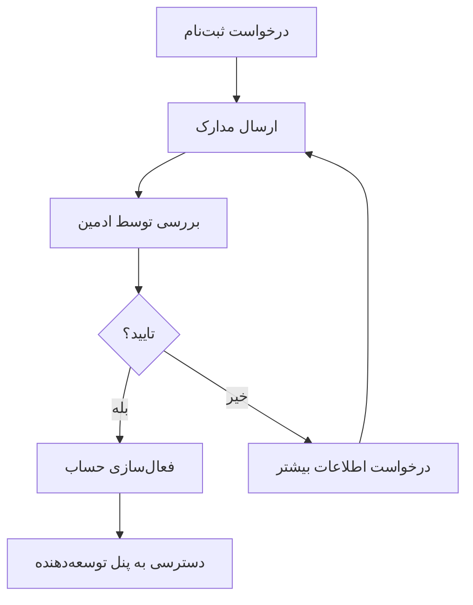
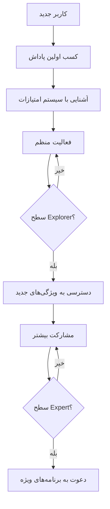

# نقش‌های کاربری و سطوح دسترسی
# User Roles & Access Levels

## 👑 1. مدیر عامل اصلی (Super Admin)

### دسترسی‌های کامل:
```typescript
interface SuperAdminPermissions {
  // Data Access
  viewAllUserData: true;
  exportUserDatabase: true;
  viewFinancialReports: true;
  accessSystemLogs: true;
  
  // Contract Management
  accessContractRoom: true;
  moderateDeveloperMeetings: true;
  approvePartnershipDeals: true;
  
  // Payment Control
  approvePayouts: true;
  suspendPayments: true;
  adjustRewardRates: true;
  manageTokenSupply: true;
  
  // User Management
  banUsers: true;
  promoteUsers: true;
  deleteAccounts: true;
  viewPrivateMessages: true;
}
```

### ویژگی‌های اختصاصی:
- **اتاق عقد قرارداد**: دسترسی به محیط خصوصی مذاکره
- **کنترل پرداخت‌ها**: قابلیت توقف یا تایید تمام تراکنش‌ها
- **Analytics پیشرفته**: گزارش‌های مالی و عملکردی کامل
- **مدیریت بحران**: ابزارهای اضطراری برای حل مشکلات

## 👨‍💻 2. توسعه‌دهندگان (Developers)

### فرآیند ثبت‌نام:


### دسترسی‌های توسعه‌دهنده:
```typescript
interface DeveloperPermissions {
  // App Management
  createMiniApp: true;
  updateOwnApps: true;
  viewAppAnalytics: true;
  manageAppVersions: true;
  
  // Financial
  viewEarnings: true;
  requestPayout: true;
  viewTransactionHistory: true;
  
  // Support
  accessTicketSystem: true;
  viewDocumentation: true;
  participateInForum: true;
  
  // Restrictions
  requiresAdminApproval: ['app_publish', 'major_updates'];
  cannotAccess: ['other_developer_data', 'platform_financials'];
}
```

### پنل توسعه‌دهنده:
- **Dashboard**: آمار عملکرد اپ‌ها
- **App Manager**: مدیریت و به‌روزرسانی اپ‌ها
- **Analytics**: تحلیل رفتار کاربران
- **Earnings**: گزارش درآمد و برداشت

## 🏪 3. صاحبان کسب‌وکار معمولی (Business Owners)

### ویژگی‌های پایه:
```typescript
interface BusinessOwnerFeatures {
  // Basic Features
  createBasicMiniApp: true;
  basicCustomerSupport: true;
  basicAnalytics: true;
  standardListingBoost: 'limited';
  
  // Limitations
  maxAppsAllowed: 3;
  analyticsRetention: '30days';
  supportResponseTime: '48hours';
  advertisingOptions: 'basic';
}
```

### خدمات در دسترس:
- **ایجاد مینی‌اپ ساده**: با قالب‌های آماده
- **پشتیبانی مشتری**: سیستم تیکت پایه
- **آمار محدود**: آمار ۳۰ روز گذشته
- **تبلیغات پایه**: نمایش در فهرست‌های عمومی

## 👑 4. صاحبان کسب‌وکار پرمیوم (Premium Business)

### ویژگی‌های پیشرفته:
```typescript
interface PremiumBusinessFeatures {
  // Advanced Features
  createAdvancedMiniApp: true;
  prioritySupport: true;
  advancedAnalytics: true;
  unlimitedBoosts: true;
  
  // Premium Benefits
  maxAppsAllowed: 'unlimited';
  analyticsRetention: '365days';
  supportResponseTime: '12hours';
  customBranding: true;
  
  // Advertising
  premiumAdPlacements: true;
  targetedAdvertising: true;
  adPerformanceReports: true;
}
```

### خدمات ویژه:
- **طراحی اختصاصی**: امکان سفارشی‌سازی کامل UI/UX
- **پشتیبانی اولویت‌دار**: پاسخ در کمتر از ۱۲ ساعت
- **آمار پیشرفته**: تحلیل‌های عمیق و پیش‌بینی
- **تبلیغات هدفمند**: نمایش به گروه‌های خاص

## 👤 5. کاربران معمولی (Regular Users)

### سیستم انگیزشی:
```typescript
interface UserEngagementSystem {
  // Reward Activities
  miniAppTesting: {
    firstTime: 10, // PERSIAN tokens
    dailyUsage: 1,
    weeklyBonus: 25
  };
  
  communityParticipation: {
    reviewWriting: '5-50', // based on quality
    helpfulVotes: 2,
    reportBugs: 20
  };
  
  socialActivities: {
    referralBonus: 100,
    socialSharing: 5,
    contentCreation: '20-100'
  };
}
```

### سطح‌بندی کاربران:
```typescript
enum UserLevel {
  NEWCOMER = 'newcomer',      // 0-100 tokens
  EXPLORER = 'explorer',      // 100-500 tokens  
  CONTRIBUTOR = 'contributor', // 500-2000 tokens
  EXPERT = 'expert',          // 2000-10000 tokens
  CHAMPION = 'champion'       // 10000+ tokens
}

interface LevelBenefits {
  [UserLevel.NEWCOMER]: {
    rewardMultiplier: 1.0;
    specialFeatures: ['basic_profile'];
  };
  
  [UserLevel.EXPERT]: {
    rewardMultiplier: 2.0;
    specialFeatures: ['priority_support', 'beta_access', 'expert_badge'];
  };
  
  [UserLevel.CHAMPION]: {
    rewardMultiplier: 3.0;
    specialFeatures: ['vip_support', 'early_access', 'champion_badge', 'special_events'];
  };
}
```

## 🔐 سیستم مجوزها و امنیت

### Authentication & Authorization:
```typescript
class PermissionService {
  async checkPermission(
    userId: string, 
    action: string, 
    resource?: string
  ): Promise<boolean> {
    const user = await this.getUserWithRole(userId);
    const permissions = this.getRolePermissions(user.role);
    
    // Check basic permission
    if (!permissions[action]) return false;
    
    // Check resource-specific permissions
    if (resource && !this.canAccessResource(user, resource)) {
      return false;
    }
    
    // Check admin approval requirements
    if (permissions.requiresAdminApproval?.includes(action)) {
      return await this.hasAdminApproval(userId, action);
    }
    
    return true;
  }
  
  private canAccessResource(user: User, resource: string): boolean {
    switch (resource) {
      case 'developer_app':
        return user.role === 'developer' && this.isAppOwner(user.id, resource);
      case 'financial_data':
        return ['super_admin', 'developer'].includes(user.role);
      default:
        return true;
    }
  }
}
```

### Session Management:
```typescript
interface UserSession {
  userId: string;
  role: UserRole;
  permissions: string[];
  sessionId: string;
  expiresAt: Date;
  telegramData: {
    id: number;
    username?: string;
    firstName: string;
    lastName?: string;
  };
}

class SessionManager {
  async createSession(telegramUser: TelegramUser): Promise<UserSession> {
    const user = await this.getOrCreateUser(telegramUser);
    const sessionId = this.generateSecureSessionId();
    
    const session: UserSession = {
      userId: user.id,
      role: user.role,
      permissions: this.getRolePermissions(user.role),
      sessionId,
      expiresAt: new Date(Date.now() + 24 * 60 * 60 * 1000), // 24 hours
      telegramData: telegramUser
    };
    
    await this.storeSession(sessionId, session);
    return session;
  }
}
```

## 🎯 User Journey مخصوص هر نقش

### مسیر ثبت‌نام توسعه‌دهنده:
```mermaid
graph TD
    A[کلیک "ثبت‌نام توسعه‌دهنده"] --> B[تکمیل فرم اطلاعات]
    B --> C[آپلود نمونه کار]
    C --> D[تایید شرایط همکاری]
    D --> E[ارسال برای بررسی]
    E --> F[انتظار تایید ادمین]
    F --> G{تایید شد؟}
    G -->|بله| H[دسترسی به پنل توسعه‌دهنده]
    G -->|خیر| I[دریافت فیدبک و اصلاح]
    I --> B
    H --> J[آموزش اولیه و onboarding]
    J --> K[شروع توسعه اولین اپ]
```

### مسیر ارتقاء کاربر عادی:


این سیستم نقش‌های کاربری مطابق با بهترین روش‌های امنیت و UX طراحی شده است.